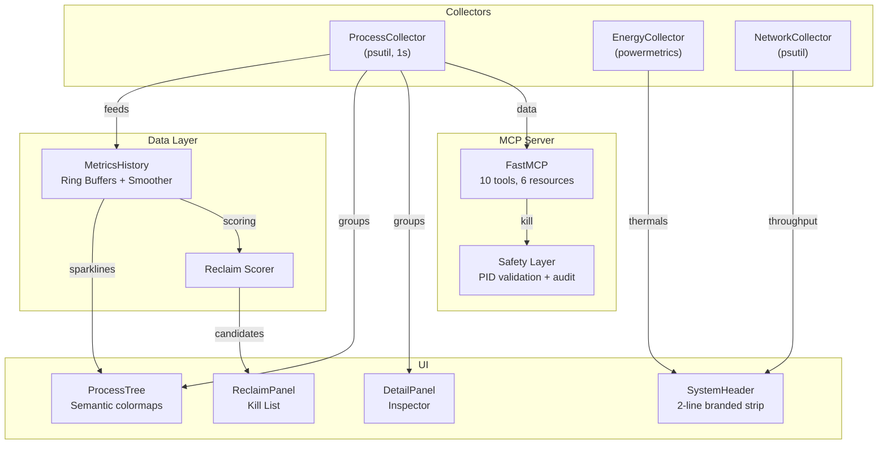

<p align="center">
  <h1 align="center">🔥 MacJet</h1>
  <p align="center">
    <strong>The flight deck for your Mac.</strong>
  </p>
  <p align="center">
    Real-time process monitoring, thermal intelligence, and an AI-native MCP server — all in your terminal.
  </p>
  <p align="center">
    <a href="LICENSE"></a>
    
    
    
    
    <a href="https://github.com/jepsontaylor/macjet/pulls"></a>
  </p>
</p>

<p align="center">
  
</p>

---

MacJet is a high-performance, developer-first terminal dashboard designed to answer the one question every Mac user asks eventually: **"Why does my laptop sound like a jet engine?"**

While standard tools treat your processes like a spreadsheet, MacJet understands the way you work. It groups messy process trees into the Apps you recognize, maps anonymous renderer PIDs back to specific Chrome tabs, and scores processes based on their "reclaimability" and thermal impact.

It's not just a dashboard; it's a **Model Context Protocol (MCP)** server, making it the first process monitor built for the AI era.

## ⚡ Quick Start

```bash
git clone https://github.com/jepsontaylor/macjet.git
cd macjet
sudo ./macjet.sh
```

That's it. No `pip install`, no config files. The launcher handles everything — venv creation, dependency installation, and graceful privilege escalation.

### To `sudo` or not to `sudo`?

MacJet is designed to run gracefully with or without root privileges, but `sudo` unlocks its true power by granting access to Apple's low-level sensors.

**With `sudo` (Recommended):**
- 🌡️ **Thermal Data**: Access CPU/GPU die temperatures and Fan speeds (RPM).
- 🔋 **Energy Impact**: Accurate, hardware-level energy scoring via `powermetrics`.
- 🛡️ **Full Control**: Ability to analyze and manage any process on the system, not just your own user processes.

**Without `sudo`:**
- 📊 **App Grouping & UI**: Full access to the terminal UI, App-centric grouping, and Chrome tab mapping.
- 📉 **Basic Metrics**: Standard CPU/Memory metrics via `psutil`.
- 🔒 **Restricted Control**: Can only interact with your own user-level processes. Thermal data and energy metrics will be disabled.

---

## Why MacJet?

Activity Monitor is a spreadsheet. `htop` is a Linux tool wearing a Mac costume. `btop` is beautiful but lacks Mac-specific intelligence.

MacJet is purpose-built for macOS from the ground up:
- **App-Centric**: Automatically groups thousands of background processes under the parent applications you actually know.
- **Thermal Awareness**: Real-time access to Apple's `powermetrics` (CPU/GPU temps, fan speed, thermal pressure).
- **Chrome Tab Tracking**: Finally see which specific browser tab is pinning your CPU.
- **Reclaim Engine**: A scoring model that identifies low-value, high-impact background processes you can safely kill to recover resources.
- **AI Native**: Built-in MCP server allows AI agents (like Claude Desktop) to troubleshoot your performance and manage processes with human-in-the-loop safety.

| Feature | Activity Monitor | htop | btop | **MacJet** |
|---|:---:|:---:|:---:|:---:|
| App-level grouping | ✅ | ❌ | ❌ | ✅ |
| Chrome tab → PID mapping | ❌ | ❌ | ❌ | ✅ |
| Energy / thermal data | ✅ | ❌ | ❌ | ✅ |
| AI agent integration (MCP) | ❌ | ❌ | ❌ | ✅ |
| Intelligent kill recommendations | ❌ | ❌ | ❌ | ✅ |
| Role-bucket grouping | ❌ | ❌ | ❌ | ✅ |
| Semantic CPU/Memory colormaps | ❌ | ❌ | ✅ | ✅ |
| Inline sparklines | ❌ | ❌ | ❌ | ✅ |

---

## ✨ Features

### 🎯 Flight Deck Layout
Five purpose-built views, switchable with `1`–`5` or `Tab`:

| View | Purpose |
|------|---------|
| **Apps** | Processes grouped by application with role-bucket expansion |
| **Tree** | Raw process hierarchy |
| **Pressure** | Memory pressure focus |
| **Energy** | Wakeups, thermal state, battery impact |
| **Reclaim** | Intelligent Kill List with scored recommendations |

### 🎨 Semantic Colormaps
- **Afterburner** (CPU): cyan → blue → violet → magenta → hot pink
- **Aurora** (Memory): green → lime → amber → orange → red
- **Severity rail**: Colored left-border indicator on every row

### 🧠 Reclaim Engine (Kill List)
A multi-factor scoring engine ranks every process group on a 100-point scale:

| Factor | Weight | Signal |
|--------|--------|--------|
| Sustained CPU (30s avg) | 30 pts | High sustained load |
| Memory footprint | 25 pts | Large RSS |
| Memory growth rate | 15 pts | Possible leak |
| Hidden/background | 15 pts | Not visible to user |
| Process storm (>10 children) | 10 pts | Runaway forks |
| High wakeups | 5 pts | Energy drain |

Each recommendation includes a **risk band** (🟢 Safe · 🟡 Review · 🔴 Danger) and a suggested action.

### 🔥 Thermal Intelligence
With `sudo`, MacJet taps into Apple's `powermetrics` for data you can't get anywhere else:
- CPU die temperature
- Fan speed (RPM)
- Thermal pressure level
- Per-process energy impact scores
- GPU active percentage

### 🌐 Chrome Tab Mapping
Connects to Chrome's DevTools Protocol to map every renderer PID to its tab title:
```
▾ Google Chrome (40)       90.2%   4.7GB
  ├─ Renderer ×12          39.8%   2.1GB
  │  ├─ 🌐 YouTube            18.2%   340MB
  │  ├─ 🌐 Gmail               8.1%   220MB
  │  └─ 🌐 ChatGPT             6.3%   190MB
  ├─ GPU ×1                46.6%   117MB
  └─ Utility ×3             0.4%    90MB
```

### 📊 Inspector Pane
Select any process or group (by pressing `w`) to see:
- 60-second CPU sparkline
- Memory growth trend
- Role breakdown
- "Why hot" analysis
- One-key actions (Kill, Suspend, Profile)

---

## 📚 Tutorials

### 1. Navigating the Flight Deck
MacJet uses a multi-view layout, similar to browser tabs. Press `1` through `5` or use the `Tab` key to cycle through the views:
- **`1` Apps**: The default view. Shows processes cleanly grouped by parent application.
- **`2` Tree**: A raw hierarchical view of every process on your system.
- **`3` Pressure**: Focuses entirely on memory hogs and RAM pressure.
- **`4` Energy**: Highlights battery drain, wakeups, and high-impact tasks (requires `sudo`).
- **`5` Reclaim**: The intelligent kill list.

**Controls**: Use the `Up` and `Down` arrows to navigate rows. Press `Enter` to expand a rolled-up App group (like "Google Chrome") to see the individual helpers and renderer tabs underneath. Press `s` to change how the list is sorted (CPU, Memory, Name, PID).

### 2. Using the Reclaim Engine
The Reclaim Engine (View `5`) takes the guesswork out of freeing up system resources. It analyzes every running process continuously and assigns a **Kill Score** from 0 to 100 based on six factors: sustained CPU usage, memory footprint, memory growth (leaks), hidden/background status, runaway process forks, and high wakeups.

When your Mac is running hot, go to the Reclaim view:
1. Look for processes in the 🟡 **Review** or 🔴 **Danger** risk bands.
2. Highlight a resource-heavy background task.
3. Press `k` to gracefully terminate it (SIGTERM), or `K` to force kill it (SIGKILL).

*Note: The Reclaim Engine protects system-critical processes (PID < 500) and won't let you kill the operating system.*

### 3. Understanding Chrome Tab Mapping
When using Chrome, Brave, Arc, or other Chromium browsers, the activity monitor usually shows dozens of anonymous "Renderer Helper" processes. 

MacJet connects to your browser's DevTools Protocol to map those anonymous processes back to the actual website.
1. Make sure Chrome is running with remote debugging enabled (`--remote-debugging-port=9222`).
2. Go to the **Apps** view (`1`).
3. Find Google Chrome and press `Enter` to expand it.
4. You will now see your specific tabs (e.g., "🌐 YouTube", "🌐 Gmail") listed with their exact CPU and Memory usage under the "Renderer" category.

---

## 🤖 AI Agent Integration (MCP Server)

MacJet ships a full **Model Context Protocol** server. Your AI agent can query system health, diagnose performance, and manage processes — with human-in-the-loop safety.

### Quick Setup

Add to your MCP client config (`claude_desktop_config.json`, Cursor settings, etc.):

```json
{
  "mcpServers": {
    "macjet": {
      "command": "./macjet.sh",
      "args": ["--mcp"],
      "description": "macOS process monitor — CPU, memory, energy, Chrome tabs, process management"
    }
  }
}
```

### Tools (10)

| Tool | Description |
|------|-------------|
| `get_system_overview` | CPU, memory, thermals, top process, plain-English verdict |
| `list_processes` | Sorted process groups with filtering |
| `get_process_detail` | Deep-dive: children, cmdlines, tabs, energy |
| `search_processes` | Search by name, command line, or context |
| `explain_heat` | Diagnose why the Mac is hot with recommendations |
| `get_chrome_tabs` | Tab-level CPU via DevTools Protocol |
| `get_energy_report` | Per-app energy impact from `powermetrics` |
| `get_network_activity` | Top processes by bytes sent/received |
| `kill_process` | Safe kill with human confirmation via elicitation |
| `suspend_process` / `resume_process` | SIGSTOP/SIGCONT without terminating |

### Resources (6)

| URI | Description |
|-----|-------------|
| `macjet://system/overview` | Live system snapshot |
| `macjet://processes/top` | Top 25 by CPU |
| `macjet://processes/{name}` | Detail by app name |
| `macjet://chrome/tabs` | All Chrome tabs |
| `macjet://energy/report` | Energy breakdown |
| `macjet://audit/log` | Kill/suspend audit trail |

### Prompts (3)

| Prompt | What it does |
|--------|-------------|
| **Troubleshoot Performance** | Attaches system overview + top processes, asks for diagnosis |
| **Optimize Chrome Memory** | Attaches tab data, asks for closure recommendations |
| **Generate System Report** | Full diagnostic report formatted for Slack/tickets |

### Safety Model

Process management commands are protected by:
1. **PID validation** — System processes (PID < 500) and the MCP server itself are blocked
2. **Human-in-the-loop** — `kill_process` uses MCP elicitation to confirm with the user before executing
3. **Audit logging** — Every kill/suspend action is logged with timestamp, client ID, and reason

> 📖 Full MCP documentation: [docs/mcp.md](docs/mcp.md)

---

## ⌨️ Keybindings

| Key | Action |
|-----|--------|
| `1`–`5` | Switch view (Apps / Tree / Pressure / Energy / Reclaim) |
| `Tab` | Cycle through views |
| `↑` `↓` | Navigate rows |
| `Enter` | Expand / collapse group or role bucket |
| `s` | Cycle sort mode (CPU / Memory / Name / PID) |
| `/` | Filter processes by name |
| `Esc` | Clear filter |
| `h` | Hide / show system processes |
| `k` | Kill selected (SIGTERM) |
| `K` | Force kill (SIGKILL) |
| `z` | Suspend / Resume |
| `p` | CPU profile (`sample`) |
| `f` | File I/O (`fs_usage`, requires sudo) |
| `n` | Network (`nettop`) |
| `y` | Syscalls (`sc_usage`, requires sudo) |
| `w` | Show context in inspector |
| `Space` | Pause / Resume data collection |
| `?` | Help |
| `q` | Quit |

---

## 🏗 Architecture



> 📖 Full architecture docs: [docs/architecture.md](docs/architecture.md)

---

## 📋 Requirements

| Requirement | Details |
|-------------|---------|
| **OS** | macOS 12 Monterey or later |
| **Chip** | Apple Silicon recommended (Intel supported) |
| **Python** | 3.10 or later |
| **Privileges** | `sudo` for full energy/thermal data (optional — gracefully degrades) |

### Dependencies

Automatically installed by `macjet.sh`:

| Package | Purpose |
|---------|---------|
| `textual` | Terminal UI framework |
| `psutil` | Cross-platform process utilities |
| `rich` | Rich text and markup |
| `mcp` | Model Context Protocol SDK (optional, for MCP server) |

---

## 🤝 Contributing

We welcome contributions! See [CONTRIBUTING.md](CONTRIBUTING.md) for:
- Development setup
- Code style guide (Black + Ruff)
- Pull request process
- Good first issues

---

## 📜 License

[MIT](LICENSE) © [Jepson Taylor](https://github.com/jepsontaylor)
