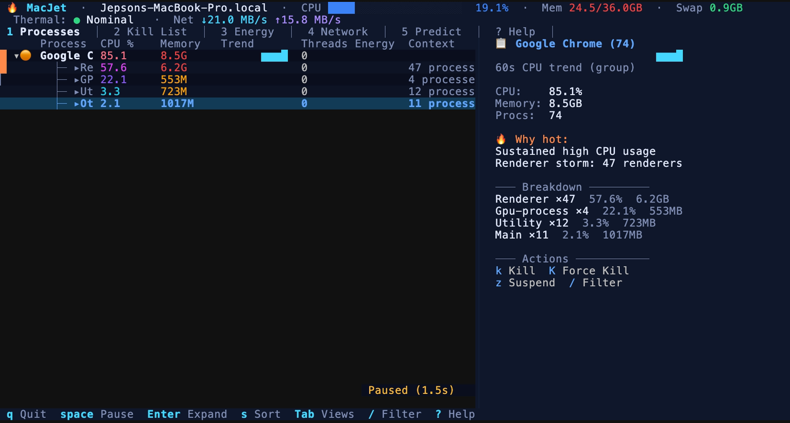
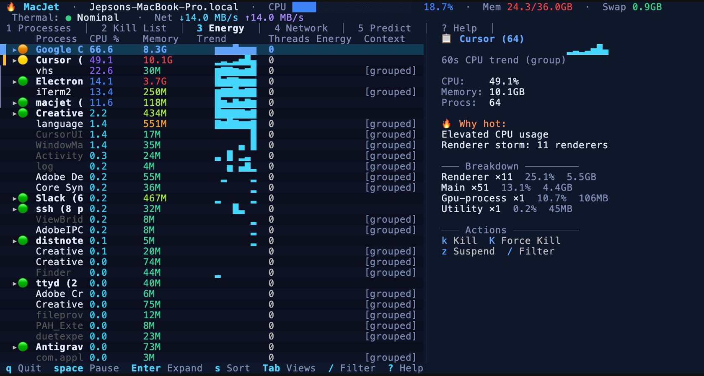
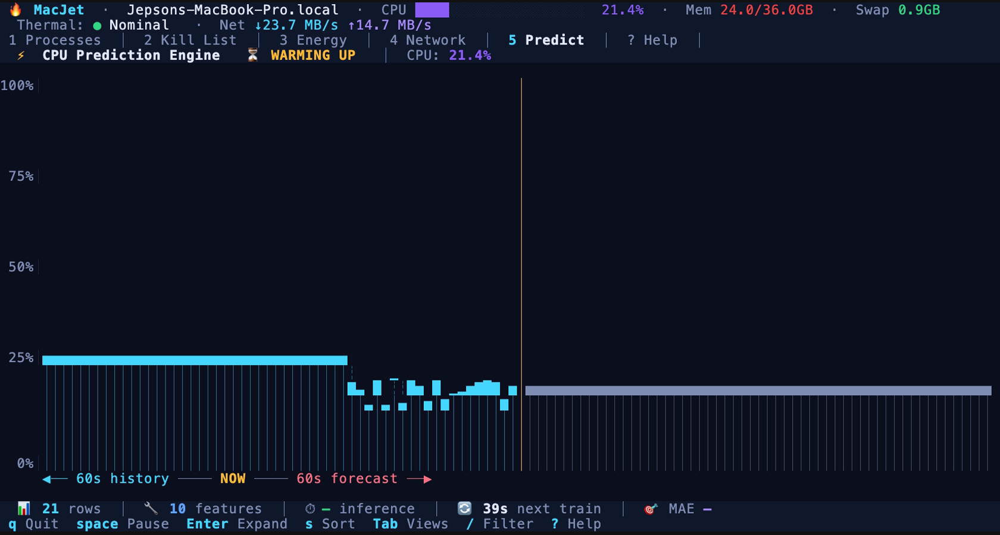
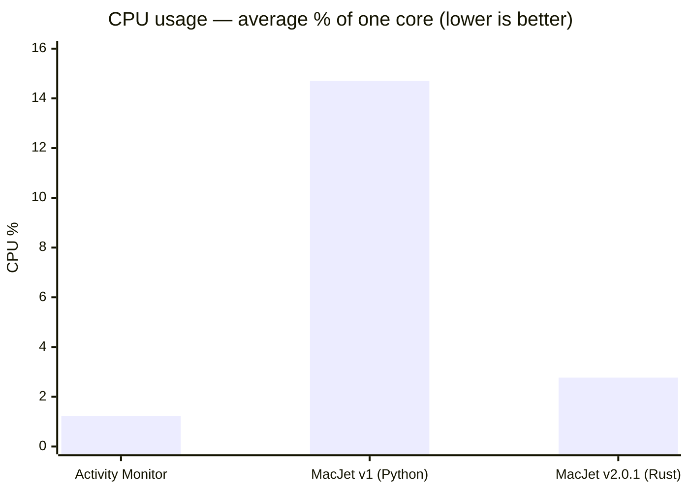

<p align="center">
  <h1 align="center">🔥 MacJet v2.0.1</h1>
  <p align="center">
    <strong>The flight deck for your Mac. 100% Rust.</strong>
  </p>
  <p align="center">
    <small>Idle CPU, reference Mac (M4 Max, macOS 15.5) — <a href="docs/benchmarks.md">methodology</a>:<br>
    <strong>benchmark_compare</strong> (same session): <strong>Activity Monitor</strong> <strong>~1.2%</strong> avg CPU ·
    <strong>MacJet v2.0.1</strong> (Rust) <strong>~2.8%</strong> avg ·
    historical <strong>MacJet v1</strong> (Python) <strong>14.7%</strong> avg (65-sample session)</small>
  </p>
  <p align="center">
    Real-time process monitoring, thermal intelligence, and an AI-native MCP server — all in your terminal.
  </p>
  <p align="center">
    <a href="LICENSE"></a>
    
    
    
    <a href="https://github.com/jeppsontaylor/MacJet/pulls"></a>
  </p>
</p>

<p align="center">
  
</p>

<p align="center"><strong>Still frames</strong> — Apps, Energy, Reclaim</p>
<table>
  <tr>
    <td align="center" width="33%">
      
      <br><sub>Apps</sub>
    </td>
    <td align="center" width="33%">
      
      <br><sub>Energy</sub>
    </td>
    <td align="center" width="33%">
      
      <br><sub>Reclaim</sub>
    </td>
  </tr>
</table>

---

MacJet is a high-performance, developer-first terminal dashboard designed to answer the one question every Mac user asks eventually: **"Why does my laptop sound like a jet engine?"**

Version **2.0.1** is a complete ground-up rewrite in **Rust** using `ratatui` and `tokio`. The table below uses **`benchmark_compare`** (sysinfo, % of one core): a **2026-03-27** run with MacJet **`--no-ml`**, **37** samples, **10 s** spacing (~6 min wall). In that session, **MacJet v2.0.1** averaged **~2.8%** CPU vs **Activity Monitor ~1.2%**; historical **Python/Textual v1** figures (**14.7%** avg CPU, 65 samples, 2 windows) come from [docs/benchmarks.md](docs/benchmarks.md) (published alongside the v2.0.1 Rust release). That is roughly **~5×** lower average CPU for Rust vs the documented Python baseline. Full methodology and older sessions: [docs/benchmarks.md](docs/benchmarks.md). JSON artifact: [`benchmark_compare_1774606304.json`](benchmark_compare_1774606304.json) at repo root (copy to `benchmarks/results/` after `mkdir -p benchmarks/results` if you use the default benchmark output path). Regenerate tables from committed JSON with `python3 scripts/benchmark_readme_snippet.py`.

## ⚡ Quick Start

```bash
git clone https://github.com/jeppsontaylor/MacJet.git
cd MacJet
cargo install --path .
```

Then, launch it:
```bash
sudo macjet
```

### From GitHub Releases

Each tagged release attaches **`macjet-macos-universal.tar.gz`** (fat binary: Apple Silicon + Intel). Extract `macjet`, place it on your `PATH`, and clear Gatekeeper quarantine if macOS blocks it: `xattr -dr com.apple.quarantine /path/to/macjet`.

### To `sudo` or not to `sudo`?

MacJet is designed to run gracefully with or without root privileges, but `sudo` unlocks its true power by granting access to Apple's low-level sensors.

**With `sudo` (Recommended):**
- 🌡️ **Thermal Data**: Access CPU/GPU die temperatures and Fan speeds (RPM).
- 🔋 **Energy Impact**: Accurate, hardware-level energy scoring via `powermetrics`.
- 🛡️ **Full Control**: Ability to analyze and manage any process on the system, not just your own user processes.

**Without `sudo`:**
- 📊 **App Grouping & UI**: Full access to the terminal UI, App-centric grouping, and Chrome tab mapping.
- 📉 **Basic Metrics**: Standard CPU/Memory metrics.
- 🔒 **Restricted Control**: Can only interact with your own user-level processes. Thermal data and energy metrics will be disabled.

---

## 🚀 Performance: Activity Monitor vs MacJet v1 (Python) vs v2.0.1 (Rust)

CPU and RSS are **% of one core** and **MB** from `benchmark_compare` / historical docs. *Python v1 is not from the same sampling session as the 2026-03-27 row.*

| Process | Avg CPU | P95 CPU | Max CPU | Avg RSS | Source / session |
|---------|---------|---------|---------|---------|------------------|
| Activity Monitor | 1.22% | 1.51% | 1.56% | 88.2 MB | `benchmark_compare` 2026-03-27; 37×10s; `--no-ml` MacJet; idle TUI |
| MacJet v2.0.1 (Rust) | 2.77% | 3.30% | 3.44% | 53.2 MB | same session — [`benchmark_compare_1774606304.json`](benchmark_compare_1774606304.json) |
| MacJet v1 (Python) | 14.7% | 20.1% | 26.2% | 26.8 MB | Historical: 65 samples, 2 windows — [docs/benchmarks.md](docs/benchmarks.md#full-results) (v1 figures published with the v2.0.1 Rust line, e.g. commit `2feed08`) |

**Takeaway:** In the **benchmark_compare** session, both apps show **small non-zero** idle CPU (measurement noise + background work); MacJet is **higher than Activity Monitor** on average CPU here but **far below** the documented **Python v1** average (**~5×** vs 14.7%).

**Memory:** In that **same** session, MacJet RSS (**~53 MB**) was **lower** than Activity Monitor (**~88 MB**). Separately, an **older documented** session ([docs/benchmarks.md](docs/benchmarks.md)) reported **~27 MB** (v1), **~64 MB** (Activity Monitor), **~109 MB** (v2, 5 views) — v2 trades more RAM for Tokio, caching, and richer UI; see [docs/benchmarks.md](docs/benchmarks.md#the-cpu-vs-memory-tradeoff).

<!-- Mermaid y-axis 0–16 keeps low CPU bars visible (same averages as the SVG). -->


<p align="center">
  
</p>

---

## ✨ Features

### 🎯 Flight Deck Layout
Five purpose-built views, switchable with `1`–`5` or `Tab`:

| View | Purpose |
|------|---------|
| **Apps** | Processes grouped by application with role-bucket expansion |
| **Tree** | Raw process hierarchy |
| **Pressure** | Memory pressure focus |
| **Energy** | Wakeups, thermal state, battery impact |
| **Reclaim** | Intelligent Kill List with scored recommendations |

### 🧠 Reclaim Engine (Kill List)
A multi-factor scoring engine ranks every process group on a 100-point scale based on: sustained CPU load, memory footprint, memory growth (leaks), process storms, and high wakeups. Target high-score apps to reclaim your system.

### 🌐 Chrome Tab Mapping
Connects to Chrome's DevTools Protocol to map every renderer PID to its actual website tab title. Stop guessing which "Google Chrome Helper (Renderer)" is drawing 100% CPU. Enable with `open -a "Google Chrome" --args --remote-debugging-port=9222`.

### 🤖 Built-in MCP Server
MacJet ships a native **Model Context Protocol (MCP)** server natively exposing 10 tools to AI Agents (like Claude Desktop). 

To use it, just configure your MCP client:
```json
{
  "mcpServers": {
    "macjet": {
      "command": "/Users/YOU/.cargo/bin/macjet",
      "args": ["--mcp"],
      "description": "macOS process monitor — CPU, memory, energy, Chrome tabs, process management"
    }
  }
}
```

> 📖 Read the full MCP capabilities in [docs/mcp.md](docs/mcp.md)

---

## ⌨️ Keybindings

| Key | Action |
|-----|--------|
| `1`–`5` | Switch view (Apps / Tree / Pressure / Energy / Reclaim) |
| `Tab` | Cycle through views |
| `↑` `↓` | Navigate rows |
| `Enter` | Expand / collapse group or role bucket |
| `s` | Cycle sort mode (CPU / Memory / Name / PID) |
| `/` | Filter processes by name |
| `Esc` | Clear filter |
| `h` | Hide / show system processes |
| `k` | Kill selected (SIGTERM) |
| `K` | Force kill (SIGKILL) |
| `z` | Suspend / Resume |
| `w` | Show context in inspector |
| `?` | Help |
| `q` | Quit |

---

## 🤝 Contributing & Architecture

We welcome contributions! See the [architecture doc](docs/architecture.md), [benchmarks](docs/benchmarks.md), and [CONTRIBUTING.md](CONTRIBUTING.md) to get started with the Rust codebase.

## 📜 License
[MIT](LICENSE) © [Jepson Taylor](https://github.com/jeppsontaylor)
