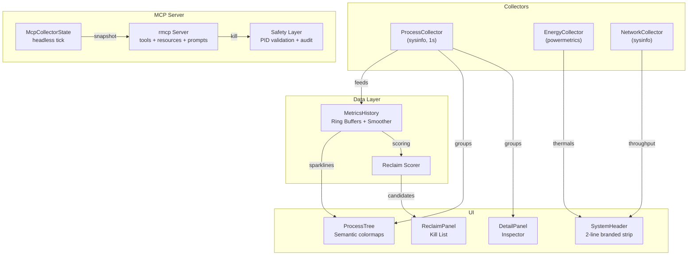
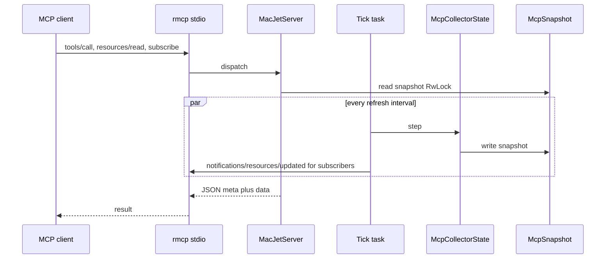

# MacJet Architecture (v2.0 Rust)

MacJet is a high-performance terminal UI and MCP server built for macOS using 100% Rust. It collects system metrics in real-time (`sysinfo`), processes them for UI rendering (`ratatui`), and exposes them to AI agents via the Model Context Protocol (`rmcp`).

**From Python to Rust:** Earlier versions used Python with Textual and `psutil`. **v2.0.1** replaces that stack with a single native binary: Tokio for scheduling collectors and MCP I/O, `sysinfo` plus macOS-specific helpers for metrics, and Ratatui for the terminal UI. The module boundaries (collectors → history → UI / MCP) mirror the old design, but everything ships as Rust crates in `src/`.

## 🏗 High-Level Architecture

`McpCollectorState` (inside the MCP subgraph) owns its own **SystemCollector**, **ProcessCollector**, **NetworkCollector**, **EnergyCollector**, **ChromeTabEnricher**, **MetricsHistory**, and optional **CpuPredictor**—parallel to the TUI’s `AppState` tick, not a second pipe from the `Collectors` subgraph above.

## MCP mode data flow

Destructive **`tools/call`** on `kill_process` may issue a client **elicitation** round-trip (when supported) before `safety::send_signal`; see [docs/mcp.md](mcp.md).

See [docs/mcp.md](mcp.md) for the full tool and resource catalog.

## 🔄 Data Flow

1. **ProcessCollector**: The core engine that runs a non-blocking background task every second using `tokio` and `sysinfo`.
2. **MetricsHistory**: Stores historical context using lock-free ring buffers, allowing MacJet to display 60-second sparklines.
3. **UI Widgets**: `ratatui` renders the UI at 60FPS using a clean message-passing architecture (`mpsc` channels).
4. **Reclaim Scorer**: A specialized heuristic engine that continuously evaluates process groups on a 100-point scale.
5. **MCP server** (`--mcp`): A dedicated Tokio multi-thread runtime runs the tick task and serves JSON-RPC; agents consume the same metrics family as the UI via tools, resources, and prompts ([docs/mcp.md](mcp.md)).
