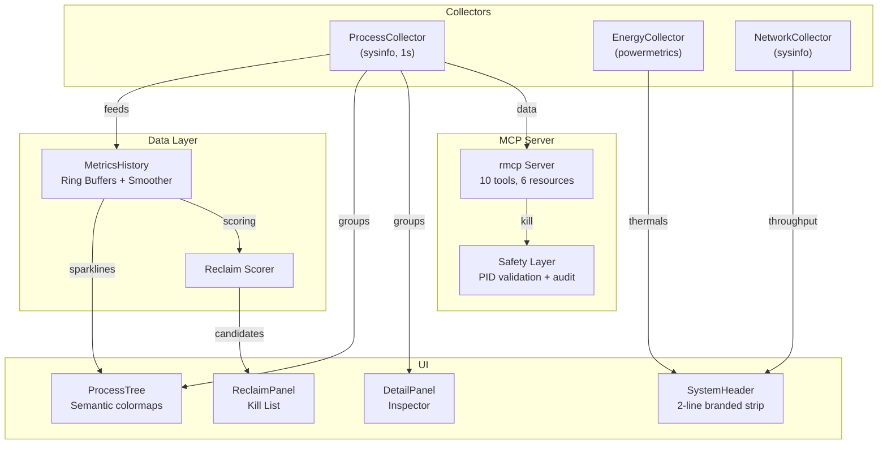

# MacJet Architecture (v2.0 Rust)

MacJet is a high-performance terminal UI and MCP server built for macOS using 100% Rust. It collects system metrics in real-time (`sysinfo`), processes them for UI rendering (`ratatui`), and exposes them to AI agents via the Model Context Protocol (`rmcp`).

**From Python to Rust:** Earlier versions used Python with Textual and `psutil`. **v2.0.1** replaces that stack with a single native binary: Tokio for scheduling collectors and MCP I/O, `sysinfo` plus macOS-specific helpers for metrics, and Ratatui for the terminal UI. The module boundaries (collectors → history → UI / MCP) mirror the old design, but everything ships as Rust crates in `src/`.

## 🏗 High-Level Architecture

## 🔄 Data Flow

1. **ProcessCollector**: The core engine that runs a non-blocking background task every second using `tokio` and `sysinfo`.
2. **MetricsHistory**: Stores historical context using lock-free ring buffers, allowing MacJet to display 60-second sparklines.
3. **UI Widgets**: `ratatui` renders the UI at 60FPS using a clean message-passing architecture (`mpsc` channels).
4. **Reclaim Scorer**: A specialized heuristic engine that continuously evaluates process groups on a 100-point scale.
