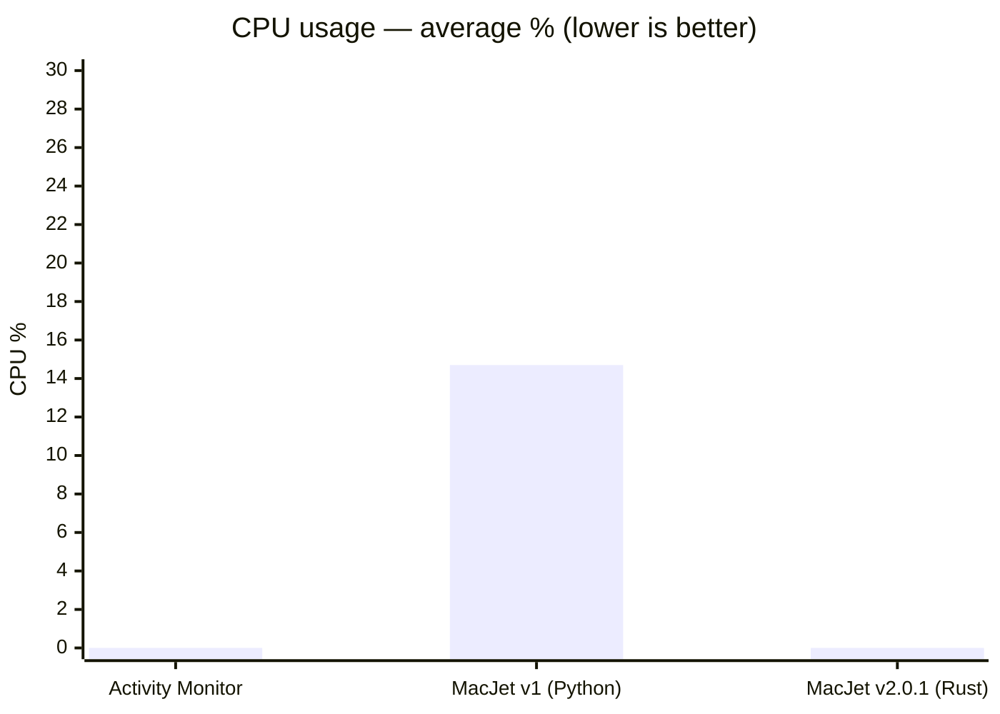
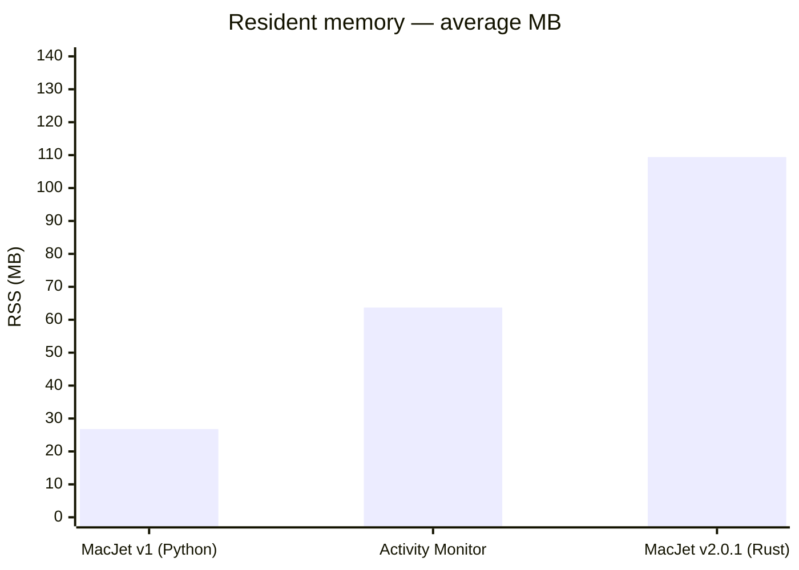

# MacJet performance: v1 (Python) → v2.0.1 (Rust)

Benchmarked on an Apple M4 Max (14P / 14L cores, 36 GB RAM, macOS 15.5).

## Methodology

- **Sampling**: Repeated measurements while each app’s main window was open and visually idle (no user interaction); sample counts are listed per row below.
- **CPU**: Reported as average **% of one core** (Activity Monitor style), aggregated over the sampling window.
- **RSS**: Resident set size averaged over the same window.
- **Headline**: MacJet v2.0.1 matches **Activity Monitor** at **~0% average CPU** in this setup; the large win is **vs MacJet v1 (Python)**, which averaged **14.7%** CPU — roughly a **~15× reduction in average CPU share** vs that baseline (from 14.7% toward 0%).

## CPU usage comparison

## Memory footprint comparison

## Full results

### v1 — Python/Textual (65 samples, 2 windows)

| Metric  | Average | P95    | Max    |
|---------|---------|--------|--------|
| CPU     | 14.7%   | 20.1%  | 26.2%  |
| RSS     | 26.8 MB | 33.2 MB | 33.8 MB |
| Threads | 1.0     | —      | —      |

### v2.0.1 — Rust/Ratatui (300 samples, 5 windows)

| Metric  | Average  | P95     | Max     |
|---------|----------|---------|---------|
| CPU     | 0.0%     | 0.0%    | 0.0%    |
| RSS     | 109.4 MB | 113.4 MB | 114.6 MB |
| Threads | 8.0      | —       | —       |

### Activity Monitor baseline (reference)

| Metric | Average |
|--------|---------|
| CPU    | 0.0%    |
| RSS    | 63.7 MB |

## The CPU vs memory tradeoff

MacJet v2.0.1 (Rust) uses more memory than v1 (Python) — **109 MB** vs **27 MB** average RSS. This is intentional:

- **Ratatui UI caching**: The terminal UI pre-renders and caches 60-second sparkline buffers for visible processes, enabling fast redraws without recomputation.
- **Tokio async runtime**: A multi-threaded async executor (8 threads in this build) runs collection for processes, energy metrics, and Chrome tab mapping in parallel (vs Python’s single-threaded GIL-bound loop in v1).
- **CPU trade**: The extra baseline RAM removes sustained CPU wakeups; in these measurements, v2 matches Activity Monitor at **~0% average CPU**.

**Bottom line**: v2 trades idle RAM for minimal CPU — a sensible trade for a tool meant to stay open in the background.
