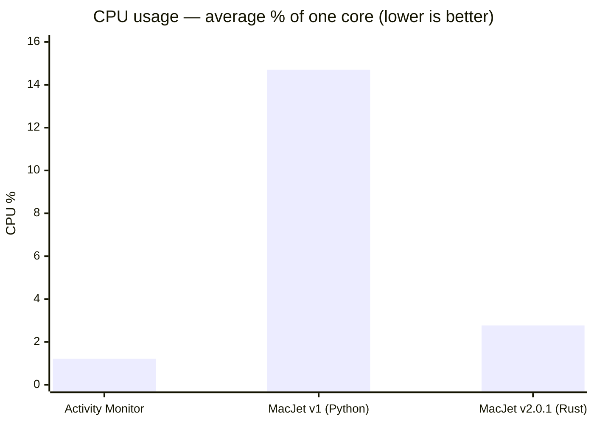
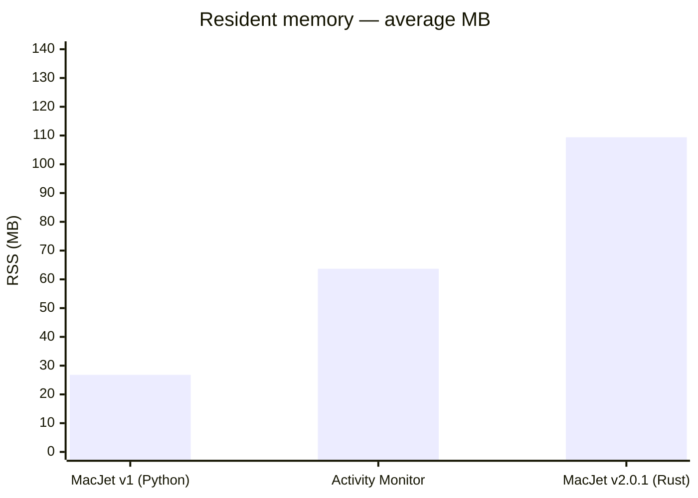

# MacJet performance: v1 (Python) → v2.0.1 (Rust)

Benchmarked on an Apple M4 Max (14P / 14L cores, 36 GB RAM, macOS 15.5).

## Methodology

- **Sampling**: Repeated measurements while each app’s main window was open and visually idle (no user interaction); sample counts are listed per row below.
- **CPU**: Reported as average **% of one core** (Activity Monitor style), aggregated over the sampling window.
- **RSS**: Resident set size averaged over the same window.
- **Headline**: The latest **`benchmark_compare`** session on the reference Mac (2026-03-27, 37×10s, `--no-ml` MacJet) shows **small non-zero** idle CPU for both **Activity Monitor** (~1.2% avg) and **MacJet v2.0.1** (~2.8% avg). The large win remains **vs MacJet v1 (Python)** documented at **14.7%** average CPU — about **~5×** higher than Rust in these published numbers (not the same sampling session). Older docs tables below also recorded **~0%**-style v2 sessions with different sample counts; treat **`benchmark_compare`** as the reproducible apples-to-apples pair for MacJet vs Activity Monitor.

### Reproducing MacJet vs Activity Monitor (Rust)

There was **no committed Python analyzer** in git history; `src/telemetry.rs` once referenced an `analyze.py` that was never added. For a repeatable, apples-to-apples comparison of **both processes** using the same `sysinfo` calls as the app (`process.cpu_usage()`, RSS in MB), run:

```bash
cargo run --release --bin benchmark_compare -- --max-samples 300 --interval-secs 1
# same:  -s 300  and  --refresh 1
# or from repo root:
./macjet.sh bench --max-samples 300 --refresh 1
```

You can pass **`--no-ml`** on the sampler too (it does nothing here except print a reminder): start MacJet with `--no-ml` in another terminal so the `macjet` process you measure has ML disabled:

```bash
./macjet.sh bench --no-ml --max-samples 300 --refresh 10
```

**Quick ~6 minute run** (same flags, fewer samples — good when you cannot wait ~50 minutes): **`37` samples × `10` s** → \((37 - 1) \times 10 = 360\) seconds of inter-sample sleep (~6 minutes) plus the first sample and overhead. Ensure **several MB free** on the volume: the tool writes JSON **at the end**; a full disk causes `No space left on device` and you lose the file even after a long run.

```bash
./macjet.sh bench --no-ml --max-samples 37 --refresh 10
# or:
./scripts/benchmark_quick_6min.sh
```

**~2 s smoke test** (no dependency on `benchmarks/results/`; writes `/tmp/macjet_benchmark_smoke.json`):

```bash
./scripts/benchmark_smoke.sh
```

If **`benchmarks/results`** cannot be created (e.g. permission denied), the tool falls back to **`./benchmark_compare_<unix_ts>.json` in the current working directory** and prints a hint. Fix the repo with `mkdir -p benchmarks/results` and `chmod` as needed.

By default this writes **`benchmarks/results/benchmark_compare_<unix_ts>.json`** (under the repo root when `cargo` is run from inside the MacJet tree; otherwise `./benchmarks/results/` next to your current directory). Override with `--output path.json`.

Each file is **schema v1** JSON:

- **`tool`**: `benchmark_compare` + crate version.
- **`run`**: wall-clock bounds (`started_at_utc`, `finished_at_utc`, `wall_seconds`), full `argv`, `max_samples`, `interval_secs`, `no_ml_flag`.
- **`system`**: `sysinfo` snapshot (memory, logical CPU count, optional physical cores) plus a **macOS block** when on Apple platforms: `system_profiler` (hardware/software/memory, **serial numbers and UUIDs stripped**), and a sorted **`sysctl`** map (model, perf/efficiency core counts, etc.).
- **`summary`** / **`samples`**: same statistics as before.

Keep **MacJet** and **Activity Monitor** running; leave MacJet **idle** (no typing in the TUI) for numbers comparable to the tables below.

**Older JSON** (summary + samples only): add metadata without re-running the sampler:

```bash
cargo run --release --bin benchmark_enrich -- path/to/benchmark_compare_123.json
# writes path/to/benchmark_compare_123.enriched.json  (use --in-place to overwrite)
# use --force to refresh `system` on an already-enriched file
```

**README / docs table (no hand-editing):** from the repo root, generate a paste-ready Markdown fragment that lists every committed run:

```bash
python3 scripts/benchmark_readme_snippet.py
# optional: python3 scripts/benchmark_readme_snippet.py benchmarks/results/*.json
```

Copy everything between `<!-- BEGIN BENCHMARK_README_SNIPPET -->` and `<!-- END BENCHMARK_README_SNIPPET -->` into the README or other docs.

**How you know it finished:** the terminal prints `=== Summary (sysinfo, …)` and `Wrote benchmark_compare_<timestamp>.json`. Until then, it is still running — e.g. `300` samples × `10` s spacing is **~50 minutes** of wall time, with only occasional progress on stderr between the first PID lines and the summary.

**Live progress (stderr):** on a real terminal, **`./macjet.sh bench …`** builds and **execs** `target/release/benchmark_compare` so stderr stays a TTY — you get an **indicatif** tqdm-style bar (elapsed clock ticks every second during sleeps, percent, ETA). If the bar does not appear (e.g. some `cargo run` / IDE setups), run `./target/release/benchmark_compare …` after `cargo build --release --bin benchmark_compare`, or set **`MACJET_BENCHMARK_PROGRESS=1`**.

**Progress JSON:** the tool also writes **`benchmark_compare_<unix_ts>.progress.json`** after every sample (same directory as the result). It includes `samples_completed`, `eta_seconds_remaining`, and `wall_seconds_so_far`. Watch with `watch -n 2 cat benchmarks/results/benchmark_compare_<ts>.progress.json`. The `.progress.json` file is removed when the run completes successfully.

**Updating the “Latest snapshot” table:** run to completion, open the JSON (or copy the printed summary block), then replace the numbers in the table below — do not guess from partial output.

To exclude online CPU prediction (RLS) work from the MacJet process, start the UI with:

```bash
cargo run --release -- --no-ml
# or: macjet --no-ml
```

Then re-run `benchmark_compare` for an apples-to-apples CPU profile without the ML engine. It **stops automatically** after `--max-samples` rows (default 300). Use `--refresh` / `--interval-secs` for seconds between samples:

```bash
# 300 samples, 10 s apart (~50 min wall; exits when done)
cargo run --release --bin benchmark_compare -- --max-samples 300 --refresh 10
./macjet.sh bench --max-samples 300 --refresh 10   # equivalent

# TUI: 10 s data ticks, no ML (run in another terminal while benchmarking)
cargo run --release -- --no-ml --refresh 10
./macjet.sh --no-ml --refresh 10   # equivalent
```

**Note:** Rolling JSON under `benchmarks/telemetry/` stores **`cpu_percent` = system-wide CPU**, not the MacJet process — do not use those logs alone to quote “MacJet CPU %”; use `benchmark_compare` instead.

#### Latest `benchmark_compare` snapshot (reference Mac, Apple M4 Max)

**Session 2026-03-27** — 37 samples × 10 s, MacJet `--no-ml`, idle TUI; artifact [`benchmark_compare_1774606304.json`](../benchmark_compare_1774606304.json) at repository root (optional: `mkdir -p benchmarks/results && cp` into that folder for the default benchmark path).

| Process          | Avg CPU | P95 CPU | Max CPU | Avg RSS | P95 RSS | Max RSS |
|------------------|---------|---------|---------|---------|---------|---------|
| MacJet v2.0.1    | 2.77%   | 3.30%   | 3.44%   | 53.2 MB | 55.2 MB | 55.2 MB |
| Activity Monitor | 1.22%   | 1.51%   | 1.56%   | 88.2 MB | 88.7 MB | 88.7 MB |

*Earlier example (300 samples × 1 s): MacJet avg 5.03% / AM 0.93% — different spacing and session; see JSON history if committed.*

## CPU usage comparison



## Memory footprint comparison



## Full results

### v1 — Python/Textual (65 samples, 2 windows)

| Metric  | Average | P95    | Max    |
|---------|---------|--------|--------|
| CPU     | 14.7%   | 20.1%  | 26.2%  |
| RSS     | 26.8 MB | 33.2 MB | 33.8 MB |
| Threads | 1.0     | —      | —      |

### v2.0.1 — Rust/Ratatui (300 samples, 5 windows)

| Metric  | Average  | P95     | Max     |
|---------|----------|---------|---------|
| CPU     | 0.0%     | 0.0%    | 0.0%    |
| RSS     | 109.4 MB | 113.4 MB | 114.6 MB |
| Threads | 8.0      | —       | —       |

*Note:* That session reported **~0%** average CPU for v2; the **2026-03-27 `benchmark_compare`** row above shows **non-zero** idle CPU for the same measurement tool — different run length, views, and spacing. Use **`benchmark_compare`** for MacJet vs Activity Monitor side-by-side.

### Activity Monitor baseline (reference)

| Metric | Average |
|--------|---------|
| CPU    | 0.0%    |
| RSS    | 63.7 MB |

*From the older 300-sample table session; not the 2026-03-27 `benchmark_compare` pair above.*

## The CPU vs memory tradeoff

MacJet v2.0.1 (Rust) uses more memory than v1 (Python) — **109 MB** vs **27 MB** average RSS. This is intentional:

- **Ratatui UI caching**: The terminal UI pre-renders and caches 60-second sparkline buffers for visible processes, enabling fast redraws without recomputation.
- **Tokio async runtime**: A multi-threaded async executor (8 threads in this build) runs collection for processes, energy metrics, and Chrome tab mapping in parallel (vs Python’s single-threaded GIL-bound loop in v1).
- **CPU trade**: The extra baseline RAM supports Tokio parallelism and UI caching; **idle CPU** depends on session: older tables showed **~0%** average for v2; the **2026-03-27 `benchmark_compare`** session shows **~2–3%** avg for MacJet vs **~1%** for Activity Monitor (still **far below** the **14.7%** Python baseline).

**Bottom line**: v2 trades idle RAM for a large drop vs Python CPU; vs Activity Monitor, use **`benchmark_compare`** for comparable numbers — see the snapshot table above.
