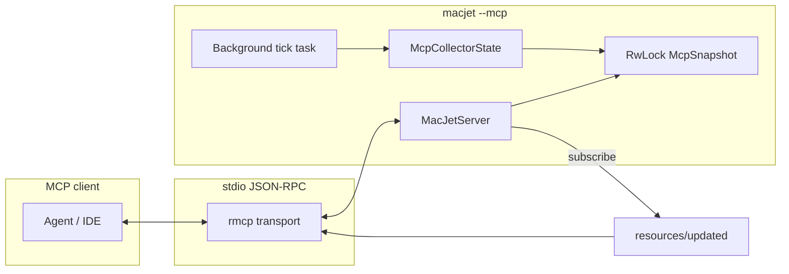

# AI Agent Integration (MCP Server)

MacJet runs a **Model Context Protocol** server over stdio (`macjet --mcp`) using the same collector logic as the TUI: `sysinfo` processes, network deltas, optional **powermetrics** (when root), Chrome CDP tab titles (port 9222), and the **reclaim** scorer. **Disk index** data (`macjet://disk/*`, disk tools) is read from the same **SQLite** file the TUI builds (`default_disk_index_path()`); run the Disk tab once so the index exists. The MCP server maintains a **live `McpSnapshot`** updated on every refresh interval and returns **`meta` + `data`** JSON so agents always know freshness and capability flags.

## Architecture (agent view)



- **`McpCollectorState`** runs the same logical steps as `AppState::tick` (without TUI-only pauses): system stats, process tree, network, `MetricsHistory`, Chrome enricher, optional `CpuPredictor`, energy snapshot.
- **Tools** and **resources** read the snapshot (and lock `McpCollectorState` briefly for reclaim scoring). **`AsyncTTLCache`** deduplicates repeated resource reads within one refresh period.
- After a successful **`kill_process`**, the resource cache is **invalidated** so the next read reflects process changes.

## MCP operations reference

Capabilities advertised in **`initialize`**: tools, resources (with **subscribe** and **listChanged**), prompts, logging, completions.

| MCP request | MacJet behavior |
|---------------|-----------------|
| `initialize` | Returns capabilities + `instructions` (quick-start for agents). |
| `ping` | Always OK. |
| `tools/list` | Lists all tool schemas (see table below; `kill_process` omitted if read-only). |
| `tools/call` | Dispatches to live snapshot + collectors; JSON text content with `meta`/`data` envelope where applicable. |
| `resources/list` | Fixed `macjet://` URIs (+ legacy aliases). |
| `resources/templates/list` | URI templates for group-by-name and pid. |
| `resources/read` | Same payloads as tools; cached per URI for TTL = refresh interval. |
| `resources/subscribe` / `unsubscribe` | Tracks URIs; each tick may send `notifications/resources/updated`. |
| `prompts/list`, `prompts/get` | Curated operational playbooks. |
| `logging/setLevel` | Acknowledged; level logged under tracing target `macjet_mcp`. |
| `completion/complete` | Limited completions (e.g. resource URI prefixes, sort hints). |

### Not implemented in this release

The `rmcp` stack supports more handlers than MacJet wires up. The following are **not** advertised or are explicitly unsupported so clients do not rely on them:

- **Sampling** (`sampling/createMessage` and related server-as-model flows)
- **Tasks** (`tasks/*` — queued long-running tool execution)
- **Roots** (`roots/list` and workspace roots)
- **Elicitation** is used **only** for `kill_process` human confirmation when the client declares elicitation support; there is no generic elicitation API for other tools.

### Source layout (Rust)

| Path | Responsibility |
|------|------------------|
| [`src/mcp/server.rs`](../src/mcp/server.rs) | `MacJetServer` / `ServerHandler`: `initialize`, tools, resources, templates, subscribe, prompts, completions, logging, `kill_process` + elicitation |
| [`src/mcp/runtime.rs`](../src/mcp/runtime.rs) | `McpCollectorState`, background tick task, `notify_resource_updated` for subscribers |
| [`src/mcp/snapshot.rs`](../src/mcp/snapshot.rs) | `McpSnapshot`, `McpMeta`, `wrap`, sorting, heat explanation, network/energy DTO helpers |
| [`src/mcp/resources.rs`](../src/mcp/resources.rs) | JSON builders shared by `resources/read` and some tools |
| [`src/mcp/models.rs`](../src/mcp/models.rs) | Serde types for MCP JSON (`SystemOverviewExtended`, `ReclaimCandidateMcp`, …) |
| [`src/mcp/safety.rs`](../src/mcp/safety.rs) | PID validation, `send_signal`, audit JSONL |
| [`src/mcp/cache.rs`](../src/mcp/cache.rs) | `AsyncTTLCache` for resource reads |
| [`src/mcp/disk_index.rs`](../src/mcp/disk_index.rs) | Read-only disk SQLite: summary, duplicates, directory children, gated trash |
| [`src/mcp/elicit.rs`](../src/mcp/elicit.rs) | `KillProcessHumanConfirm` schema for elicitation |

Disk resources and tools are summarized in [disk_view.md](disk_view.md).

## Quick setup

```json
{
  "mcpServers": {
    "macjet": {
      "command": "/absolute/path/to/macjet",
      "args": ["--mcp", "--refresh", "1"],
      "description": "macOS performance — CPU, memory, thermal, processes, network, Chrome tabs, reclaim list"
    }
  }
}
```

- Use an **absolute** path to the `macjet` binary (e.g. after `cargo install --path .`, often `~/.cargo/bin/macjet`).
- **`--refresh SECS`**: collector interval in seconds (same flag as the TUI; minimum `1`). Passed through to MCP background collection.
- **`--no-ml`**: disables the online CPU predictor; `get_prediction_stats` then reports ML off.

## Response envelope

Most tool and resource JSON payloads are shaped as:

```json
{
  "meta": {
    "schema_version": 1,
    "collected_at_unix": 1712345678.9,
    "refresh_interval_secs": 1,
    "hostname": "…",
    "macjet_version": "2.0.1",
    "capabilities": {
      "powermetrics": false,
      "chrome_cdp": true,
      "ml_predictor": true
    }
  },
  "data": { }
}
```

`capabilities.powermetrics` is `true` only when the energy collector successfully runs with sufficient privileges. `chrome_cdp` reflects whether the last CDP fetch to `http://localhost:9222/json` succeeded.

## Tools

| Tool | Purpose |
|------|---------|
| `get_system_overview` | CPU, memory, swap, cores, optional thermal/fan/GPU temps (`include_swap`, `include_thermal`). |
| `list_process_groups` | Paginated groups: `sort` (`cpu` \| `mem` \| `name`), `limit`, `offset`, `filter`, `include_system`. |
| `get_process_group` | One group by name (exact case-insensitive, else first substring match). `include_cmdline` default **false**. |
| `get_process_by_pid` | Group containing PID. `include_cmdline` default **false**. |
| `get_reclaim_candidates` | Heuristic reclaim list; `min_score`, `limit`. |
| `get_network_report` | System B/s plus top PIDs by cumulative bytes from the process sample. |
| `get_energy_report` | Powermetrics-derived wakeups when available; else `available: false` and `unavailable_reason`. |
| `list_chrome_tabs` | CDP page list when Chrome is started with remote debugging. |
| `get_audit_log` | Last `limit` lines from the audit file (see below). |
| `explain_system_heat` | Narrative summary; optional `focus_pid`. |
| `get_prediction_stats` | RLS predictor stats when ML enabled. |
| `kill_process` | **Omitted** when `MACJET_MCP_READONLY=1`. Otherwise SIGTERM after **elicitation** when the client supports it. |

### `kill_process` and elicitation

If the MCP client declares **elicitation** support, MacJet shows a confirmation form (`confirm_terminate: bool`) before sending SIGTERM. If the client does **not** support elicitation, MacJet **falls back** to proceeding with the kill (same as a non-interactive client)—agents should still supply a clear `reason` for the audit log.

### Read-only mode

Set environment variable `MACJET_MCP_READONLY=1` (or `true`) so **`kill_process` is not registered** and cannot be invoked.

### Command-line privacy

Process command lines may contain secrets. They are **omitted** unless `include_cmdline` is explicitly `true` on `get_process_group` / `get_process_by_pid`. Resource reads use `include_cmdline=false` equivalent (summaries only).

## Resources

Fixed URIs (JSON, `application/json`):

| URI | Content |
|-----|---------|
| `macjet://system/overview` | Same data family as `get_system_overview` (swap + thermal on). |
| `macjet://processes/top` | Top groups by CPU (50 rows). |
| `macjet://network/current` | Network report. |
| `macjet://reclaim/candidates` | Reclaim list (`min_score` 5, limit 25). |
| `macjet://chrome/tabs` | Chrome tabs result. |
| `macjet://energy/latest` | Energy report. |
| `macjet://audit/recent` | Audit excerpt (50 lines). |

**Templates** (from `resources/templates/list`):

- `macjet://process/group?name={name}`
- `macjet://process/pid/{pid}`

Legacy aliases **`system://overview`** and **`process://top`** still resolve for older clients.

### Subscriptions

The server advertises `resources.subscribe`. After `resources/subscribe`, each collector tick may emit `notifications/resources/updated` for the subscribed URI. Clients that do not subscribe should poll at `refresh_interval_secs`.

## Prompts

- `diagnose_cpu_spike` — step-by-step tool usage for CPU investigation.
- `memory_pressure_checklist` — memory and swap workflow.
- `safe_kill_workflow` — PID rules, elicitation, audit path.

## Other protocol features

- **`logging/setLevel`**: accepted; level is logged via `tracing` (target `macjet_mcp`).
- **`completion/complete`**: basic completions for resource URI prefixes and prompt argument names where applicable.

## Audit log

Path: **`~/.macjet/mcp_audit.jsonl`** (JSON lines). Each line includes tool name, PID, signal, reason, success, client/request metadata.

## Security summary

- Refuses PIDs **&lt; 500**, nonexistent PIDs, and the **MCP server’s own PID**.
- Default kill signal is **SIGTERM** only (no MCP-exposed SIGKILL in this build).
- All destructive actions should go through the audit trail above.

## Recommended agent workflow

1. **`get_system_overview`** — establish CPU, memory, swap, thermal (if available), and `capabilities`.
2. **`list_process_groups`** with `sort=cpu` — identify top consumers; use `filter` to narrow.
3. If browser-heavy: **`list_chrome_tabs`** (ensure Chrome uses `--remote-debugging-port=9222`).
4. For cleanup hints: **`get_reclaim_candidates`** (heuristic; not a substitute for human judgment).
5. **`get_network_report`** / **`get_energy_report`** when investigating I/O or wakeups (energy needs privileges).
6. Only after explicit user intent: **`kill_process`** with `reason` (and elicitation when the client supports it).

## Troubleshooting

| Symptom | Likely cause |
|---------|----------------|
| `capabilities.powermetrics: false` | Energy thread did not start; run with **root** if you need powermetrics-style data. |
| `cdp_connected: false` / empty Chrome tabs | Chrome not started with remote debugging, or nothing listening on **9222**. |
| Stale process list | Normal within **`refresh_interval_secs`**; subscribe to resources or poll again. |
| `kill_process` missing from tools | **`MACJET_MCP_READONLY=1`** is set. |

## Verification (development)

From the repository root:

```bash
cargo test
cargo clippy --all-targets
```

MCP-specific unit tests live under `src/mcp/` (`snapshot`, `resources`, `cache`, `safety`). There is no default integration test that spawns a full stdio MCP session (would be environment-dependent); use a real MCP client against `macjet --mcp` for end-to-end checks.
